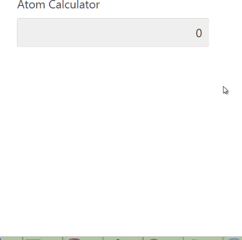

# Oracle APEX dynamic Action Plugin - AtomCalculator
AtomCalculator is a dynamic action plugin that allows users to perform calculations in realtime during data entry by providing a popup calculator for the Input and get the final result.

## Documentation

Available on
[Atom Calculator](http://apexfusion.blogspot.com/2017/04/oracle-apex-dynamic-action-plugin-atom.html "Atom Calculator Homepage")

## Donate

## Changelog

#### 1.0 - Initial Release

## Install
- Import plugin file "dynamic_action_plugin_com_planetapex_atom_calculator.sql" from source directory into your application
- (Optional) Deploy the CSS/JS files from "src" directory on your webserver and change the "File Prefix" to webservers folder.

## Preview

## Demo Application
[Atom Calculator Application](https://apex.oracle.com/pls/apex/f?p=83009:30 "Atom Calculator Homepage")
